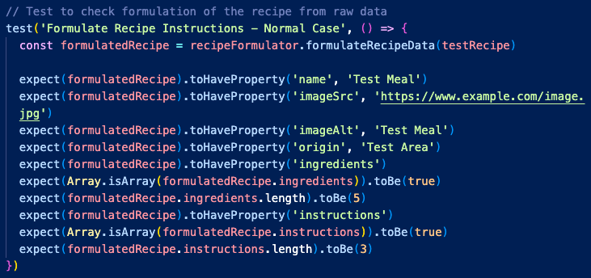

# Clean Code Reflections  
Author: Hilja-Maria Paananen 

Course: 1dv610 Laboration 3

Date: 21.10.2025

Here are my personal reflections based on the course book "Clean Code" by Robert C. Martin, Chapters 2–11.  

As the book is in English, I decided to write my reflections in English as well (even though the test report and requirements specifikation are in Swedish).

Lastly I want to mention that last spring I had to take a break from my studies due to personal circumstances. Because of this, getting started again was quite tough. 

---

## Chapter 2: Meaningful Names

When writing code I thought a lot about whether the names would be understandable for someone only seeing a small part of the code. In the past I have even had trouble understanding my own code due to unclear names. I think I mostly succeeded in naming components, methods and constants clearly in this app and the UnitConverter module. I also managed to avoid creating magic numbers.
An example of good naming:

I wonder if using Handler (ApiHandler), application (recipe-application) or Coordinator in class and component names is too vague. These might fall into the same category as Manager and Processor that are mentioned in the book. On the other hand I could not come up with better alternatives.

Additionally, I am not quite satisfied with are the names of converters in the UnitConverter module. I aimed for consistency and clarity by naming them by their purpose. With a large number of conversions available, the names became a bit hard to read and too long. 

In speed converters I have even used abbreviations to make the names significantly shorter. It is against Clean Code principles, as abbreviations are easy to misunderstand and hard to pronounce.

---

## Chapter 3: Functions

I tried to keep my methods small and with a single responsibility by separating them into multiple parts. Even in the UnitConverter module, I kept methods as small as possible.

I also figured that it is better to call helper functions instead of making my constructors and connectedCallbacks do more than one thing. #setEventListener has a single responsibility and is called in the connectedCallback of custom-button. 

In my app i succeeded quite well in keeping function arguments minimal. The same  cannot be said about the UnitConverter module, as it has many functions with far too many arguments. This is against Clean Code and makes the functions hard to use and understand. Even I put arguments in the wrong order when using the module in this application. However, fixing this would require significant changes in the module.

---

## Chapter 4: Comments

I used JSDoc on many class methods to explain functionality and expected input/output. Methods with self explanatory names and arguments were left without JSDoc. 

I avoided using inline comments when the code was self-explanatory. I tried to make the code itself explain it's functionality instead of using comments.
There is however a couple of exceptions where a comment made a syntax easier to understand.

---

## Chapter 5: Formatting

I followed consistent indentation and spacing throughout the project. Line breaks are used regularly to separate logical sections for readability.   

The structure inside each class follows a logical order with instance variables and the constructor at the top. Dependent functions are located vertically close.

In the future, ESLint or Prettier could help keep the formatting identical in every file.

---

## Chapter 6: Objects and Data Structures

My RecipeFormulator, ApiHandler, and RecipeConverter classes hide their implementation quite well. Private methods and variables encapsulate logic and only the main public methods are exposed. This approach prevents misuse and makes classes easier to understand and use in isolation. 

The UnitConverter module also encapsulates conversion logic quite well. 

---

## Chapter 7: Error Handling

I used a try...catch block in ApiHandler to handle API related issues gracefully. I wonder however, if it is against Clean Code to throw errors inside of catch blocks. Another try...catch block is located in the recipe-application to handle all possible problems by showing an error message in the UI. 

I think my error handling and validation could definitely be improved more. In some functions it would be better to throw exceptions instead of frequently returning unnecessary objects. On the other hand, these exceptions would need to be handled correctly as they are not meant to stop the application from continuing.

When I do throw errors, the messages are informative, like "Failed to fetch data from API". I also avoided using null at all times. Validation should be made stricter to avoid misuse.

---

## Chapter 8: Boundaries

My main boundary is TheMealDB API, which is accessed only through the ApiHandler class. Isolating API communication in one module lets me easily change the data source later without greatly affecting the UI. This also makes adding new functionality easier and supports separation of concerns.

Similarly, my RecipeConverter class is the only module that uses the external UnitConverter module. This whole application only relies on UnitConverter's interface. The module could easily be switched to a different module without affecting the rest of the application code.

---

## Chapter 9: Unit Tests

The UnitConverter Module is almost completely covered by automatic Jest tests. Integration was easier knowing that the code works and has been tested. I named my tests descriptively and tried to ensure that they cover both normal and edge cases. 

I test one feature / behavior per test, but I do have many expect sequences with different values in each test case. If I understood correctly, it is not exactly Clean Code to assert multiple things in one test, but this approach felt more efficient.

I encountered the same thought when writing the application tests. Methods return relatively large objects, that need to be validated to ensure correctness. This in turn means many expect sequences within one test.

---

## Chapter 10: Classes

In this project and in the UnitConverter module, most classes follow the Single Responsibility Principle. For example, ApiHandler handles API requests, RecipeFormulator transforms data, and RecipeConverter manages unit conversion. 
Private fields and methods along with public ones enforce encapsulation.

Components like recipe-application and UnitConverter in the module are classes that have a lot of responsibilities. Both of them control most of the functionality and flow of their respective applications. They could be broken into multiple classes.

An interface and base class are used in the UnitConverter module to reduce complexity. Interfaces could be utilized even more in the module and web application.

---

## Chapter 11: Systems

My system is divided into relatively small, self-contained modules: UI web components, logical classes, and an external conversion module (UnitConverter). The module acts as more of a lower-level utility layer, while the app is the presentation and orchestration layer. 

UnitConverter is not tied to this particular application and is reusable in other contexts as well. 

I could use dependency injection more widely to further support the Single Responsibility Principle. 

---
