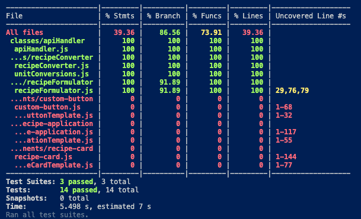
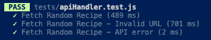
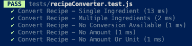
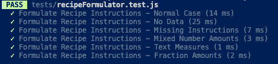

# Testrapport 

För att köra de automatiska testerna, använd följande kommando i terminalen:

```sh
npm run test
```

Varje klass-element har Jest-testfall som finns i /tests mappen.

Webbkomponenter har testats manuellt i webbläsaren (Chrome) enligt testrapporten.


## Testresultat

## Automatiska tester
### Översikt


Webbkomponenter har testats manuellt och täcks därför inte av Jest.

---

### ApiHandler


---

### RecipeConverter


---

### RecipeFormulator


## Manuella tester

## Översikt
| Testnamn | Resultat |
|------------|-----|
| 1. Hämta slumpmässigt recept | ✅ |
| 2. Konvertera enheter | ✅ |
| 3. Visa ursprungliga måttenheter | ✅ |
| 4. Hantera bråk och blandade mått | ✅ |
| 5. Hantera textmått och tomma mått | ✅ |
| 6. Felhantering | ✅ |

---

### 1. Hämta slumpmässigt recept
**Syfte:** Hämta och visa ett slumpmässigt recept.

**Steg:**
1. Öppna webbsidan.
2. Klicka på knappen "Get Random Recipe".

**Förväntat resultat:**
- Ett nytt recept visas.
- Receptkortet innehåller namn, bild, ursprung, ingredienser och instruktioner.
- Ingredienser och instruktioner är korrekt listade.

---

### 2. Konvertera enheter
**Syfte:** Enhetskonvertering fungerar.

**Steg:**
1. Öppna webbsidan.
2. Klicka på knappen "Get Random Recipe".
3. Klicka på knappen "Convert Values".

**Förväntat resultat:**
- Enheter (som är möjliga att konvertera) har konverterats.
- Mängder är korrekt konverterade och avrundade.

---

### 3. Visa ursprungliga måttenheter
**Syfte:** Ingredienser visas i ursprungliga enheter.

**Steg:**
1. Öppna webbsidan.
2. Klicka på knappen "Get Random Recipe".
3. Klicka på knappen "Convert Values".
4. Klicka sedan på knappen "Show Original".

**Förväntat resultat:**
- Ingredienser visas i sina ursprungliga enheter.

---

### 4. Hantera bråk och blandade mått
**Syfte:** Bråktal som `1/2` och blandade tal som `1 1/2` konverteras korrekt.

**Steg:**
1. Öppna webbsidan.
2. Klicka på knappen "Get Random Recipe" tills ett recept med decimaltal visas (de har blivit formatterade från bråktal och blandade tal).
3. Klicka på knappen "Convert Values".

**Förväntat resultat:**
- Decimaltal konverteras och visas korrekt.

---

### 5. Hantera textmått och tomma mått
**Syfte:** Mått som "a pinch" och tomma strängar hanteras korrekt.

**Steg:**
1. Öppna webbsidan.
2. Klicka på knappen "Get Random Recipe" tills ett recept med minst ett icke-numeriskt mått visas.
2. Klicka på knappen "Convert Values".

**Förväntat resultat:**
- Textmått ändras inte.

---

### 6. Felhantering
**Syfte:** Appen hanterar fel på ett säkert sätt.

**Steg:**
1. Öppna webbsidan.
2. Koppla bort internet eller Wi-Fi.
3. Klicka på knappen "Get Random Recipe".

**Förväntat resultat:**
- Ett felmeddelande "A problem occurred, please try again." visas.
- Appen kraschar inte.
